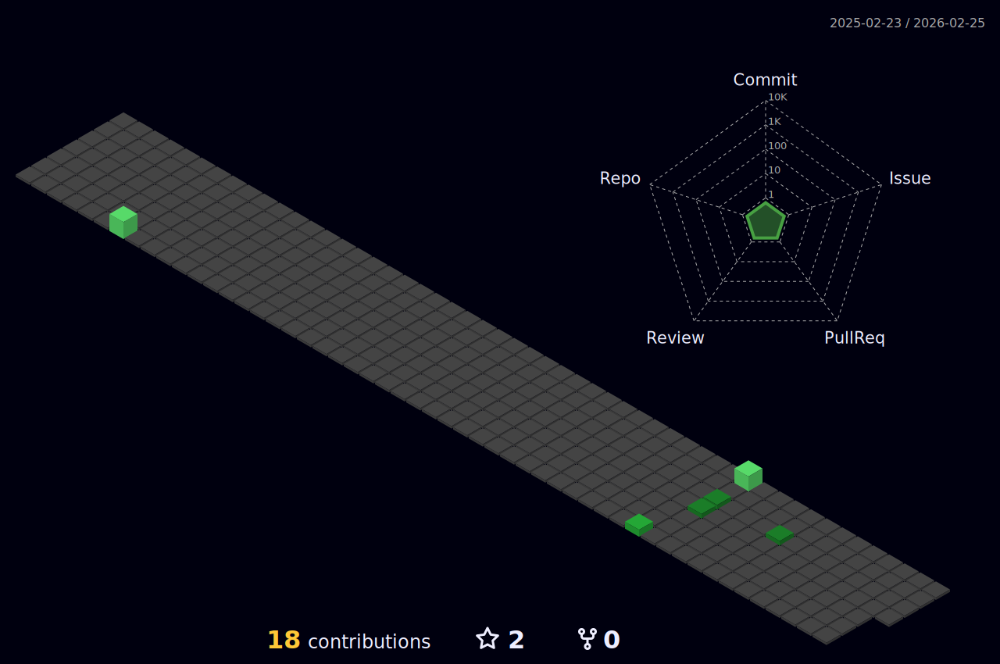

### Hi there 

<!--profile-3d-contrib/profile-night-view.svg
profile-night-green.svg
profile-night-rainbow.svg
profile-gitblock.svg

# link for: https://github.com/yoshi389111/github-profile-3d-contrib

-->

<!--
**puneet-panwar/puneet-panwar** is a ✨ _special_ ✨ repository because its `README.md` (this file) appears on your GitHub profile.

Here are some ideas to get you started:

- 🔭 I’m currently working on ...
- 🌱 I’m currently learning ...
- 👯 I’m looking to collaborate on ...
- 🤔 I’m looking for help with ...
- 💬 Ask me about ...
- 📫 How to reach me: ...
- 😄 Pronouns: ...
- ⚡ Fun fact: ...
-->
